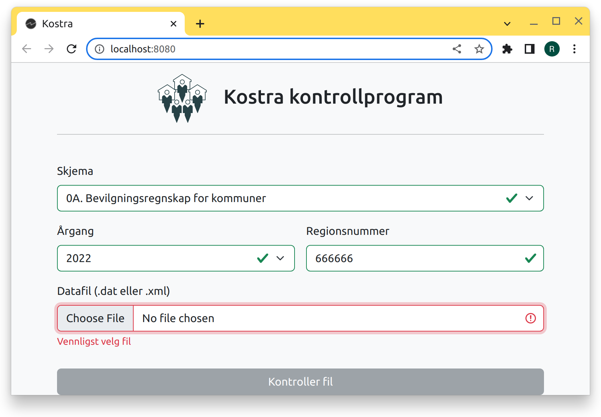

# kostra-kontrollprogram-web


kostra-kontrollprogram-web er en web-app som kjøres lokalt og benytter kostra-kontrollprogram internt for kontroll av
datafiler.

## Komme i gang med utvikling backend 

Bygge app fra rot
```bash
./mvnw clean -pl web -am install
```

Starte app fra rot
```bash
./mvnw -pl web exec:java
```

## Komme i gang med utvikling frontend

IntelliJ har som standard plugins for Typescript-utvikling.

- Node.js 18 eller nyere er påkrevet
- React Developer Tools plugin i Chrome anbefales
- Vitest Runner kan være en nyttig IntelliJ-plugin

Starte React/Vite utviklingsmiljø
```bash
cd ./web/src/main/vite-project
npm install
npm run dev
```
Backend må være tilgjengelig på port 8080. http://localhost/8081 med hot reload benyttes for frontend.

Kjøre frontend-tester (også en del av `mvn verify`)
```bash
npx vitest run
```

## Bruk (sluttbrukere)

```bash
java -jar <navn på JAR-fil>
```

## Open API

http://localhost:8080/swagger/kostra-kontrollprogram-api-1.0.yml